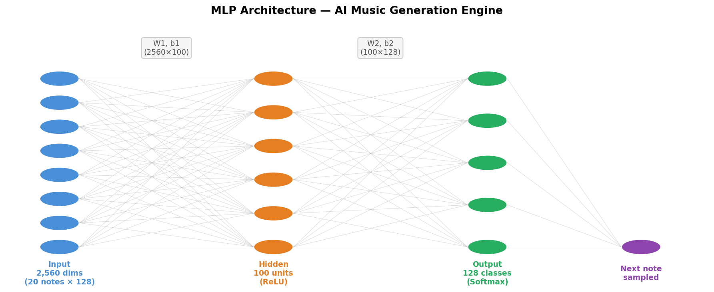
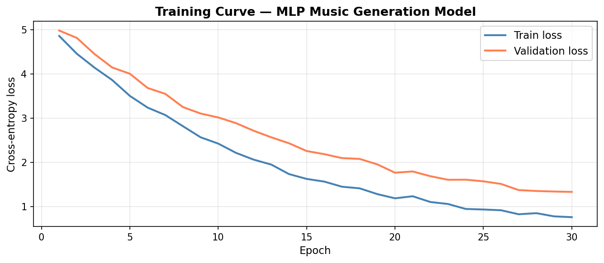
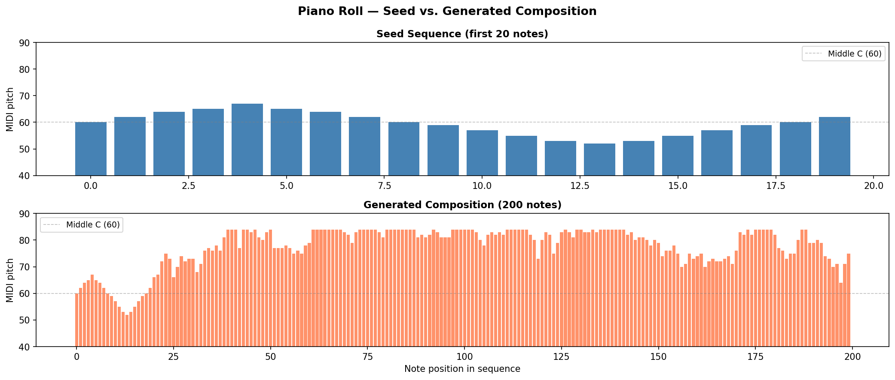
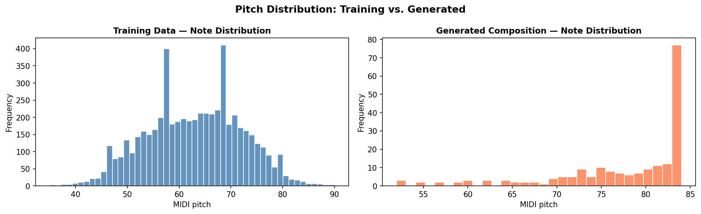

# AI Music Generation Engine — Neural Network Trained on Classical Piano

> **2-layer MLP built entirely from scratch in NumPy** — trained on Chopin MIDI data to generate original piano compositions.

---

## Overview

A creative tech client needed a generative AI system that could learn musical patterns and compose original pieces in the style of classical composers.

I built a 2-layer MLP neural network entirely from scratch in NumPy — implementing the full forward pass, softmax output layer, and vectorized backpropagation. Trained on Chopin MIDI data with one-hot encoded note sequences, the model learns to predict the next note given a 20-note context window and generates new compositions one note at a time.

## Architecture

```
Input (2,560)  →  Hidden (100, ReLU)  →  Output (128, Softmax)
  20 notes × 128 one-hot dims            probability over 128 MIDI notes
```



## Pipeline

```
MIDI files
  └── Note sequence extraction (pitch integers 0–127)
        └── Sliding window: 20-note context → next note label
              └── One-hot encoding → 2,560-dim feature vectors
                    └── Train/Val/Test split
                          └── Mini-batch SGD (30 epochs, lr=0.1)
                                └── Autoregressive generation
```

## Results

| Component | Detail |
|---|---|
| Training data | Chopin piano pieces (simplified MIDI) |
| Context window | 20 notes |
| Feature vector | 2,560 dims (20 × 128 one-hot) |
| Architecture | 2560 → 100 (ReLU) → 128 (Softmax) |
| Parameters | ~268,000 |
| Framework | **NumPy only** — no ML frameworks |

## Visualizations

| Training Curve | Piano Roll |
|---|---|
|  |  |

| Note Distribution |
|---|
|  |

## Key Implementation Details

**Why one-hot encoding for notes?**
Notes are categorical — note 64 is not "greater than" note 63 in any musical sense. Raw integers impose a false ordinality. One-hot encoding treats each pitch as an independent feature.

**Vectorized backprop:**
All gradient computations are fully vectorized matrix operations — no Python loops over training examples. The ReLU gradient is computed as a boolean mask: zero where the pre-activation was negative, one otherwise.

**Autoregressive generation:**
Rather than argmax (always picking the most likely note), the model samples from the predicted distribution — introducing musical variation and preventing immediate repetitive collapse.

## Architecture Limitations

| Architecture | Context | Long-range structure | Notes |
|---|---|---|---|
| **MLP (this project)** | Fixed 20-note window | None | Validated baseline |
| **RNN / LSTM** | Unbounded hidden state | Medium | Better for key/tempo tracking |
| **Transformer** | Full sequence (attention) | Strong | State-of-the-art (MuseNet, MusicLM) |

The MLP degrades over longer sequences because the fixed context window causes repetitive loops — the model has no mechanism to track global harmonic structure. Documented and delivered as architecture recommendations for the next iteration.

## Stack

`Python` · `NumPy` · `mido` · `matplotlib`

## Quickstart

```bash
git clone https://github.com/Sohaibsajid50/sohaibsajid50-ml.git
cd sohaibsajid50-ml/ai-music-generation
pip install -r requirements.txt

# Add your MIDI data to data/chopin/, then:
jupyter notebook music_generation.ipynb
```

---

*Built by [Sohaib Sajid](https://github.com/Sohaibsajid50)*
