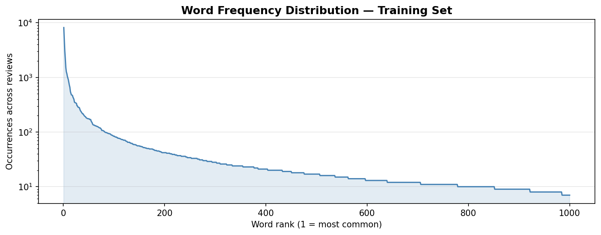
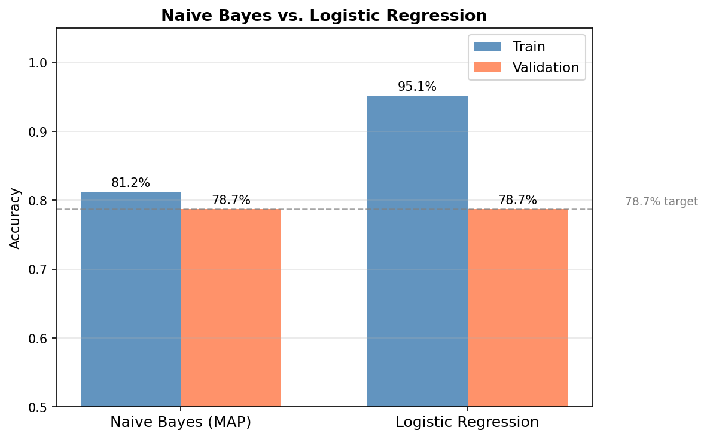
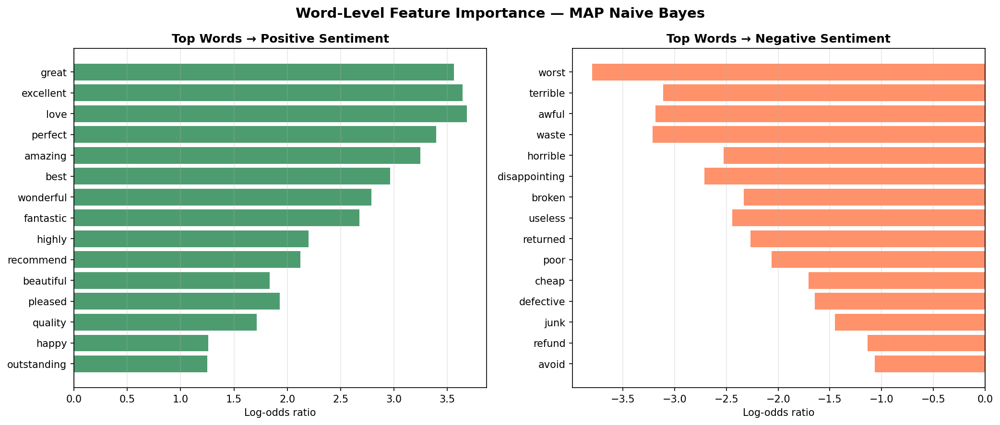

# Customer Review Sentiment Classifier — NLP Pipeline for E-commerce

> **78.7% validation accuracy** — Naive Bayes NLP pipeline built from scratch, matched against Logistic Regression baseline.

---

## Overview

An e-commerce platform was drowning in customer reviews — no way to automatically separate unhappy customers from satisfied ones without reading every single review manually.

I built a full NLP pipeline from first principles: bag-of-words representation, Naive Bayes with MAP smoothing to handle unseen words in production, and the log-sum trick to prevent numerical failure at scale.

## Results

| Metric | Value |
|---|---|
| Dataset | 16,000 customer reviews |
| Vocabulary | 1,000 words |
| Model | Naive Bayes with MAP smoothing |
| **Validation accuracy** | **78.7%** |
| Logistic Regression baseline | 78.7% (matched) |

## Pipeline

```
Raw CSV reviews
  └── Vocabulary construction (1,000 unique words)
        └── Bag-of-Words encoding (binary, per-review)
              └── Train/Val/Test split (80/10/10)
                    └── Naive Bayes (MLE → MAP smoothing)
                          └── Log-space prediction (log-sum trick)
                                └── Feature importance (log-odds ratio)
```

## Key Technical Decisions

**Why MAP over MLE?**
MLE assigns zero probability to any word absent from a class in training — `log(0)` is undefined, crashing inference. MAP with a Beta(2,2) prior adds one pseudo-count per word/class combination, guaranteeing non-zero probabilities for every vocabulary word. Essential for production where inference-time reviews contain words unseen during training.

**Why log-space prediction?**
Computing `P(x|c)` as a product of 1,000 small probabilities causes floating-point underflow — the result collapses to zero before Python can represent it. Working in log-space converts multiplication into addition, solving the problem entirely.

## Visualizations

| Word Frequency Distribution | Model Comparison |
|---|---|
|  |  |

| Feature Importance |
|---|
|  |

## Stack

`Python` · `NumPy` · `scikit-learn` · `matplotlib`

## Quickstart

```bash
git clone https://github.com/Sohaibsajid50/sohaibsajid50-ml.git
cd sohaibsajid50-ml/customer-review-sentiment
pip install -r requirements.txt

# Place trainvalid.csv and test.csv in this directory, then:
jupyter notebook sentiment_classifier.ipynb
```

## Project Structure

```
customer-review-sentiment/
├── sentiment_classifier.ipynb   # Full NLP pipeline
├── requirements.txt
├── images/
│   ├── word_frequency.png
│   ├── model_comparison.png
│   └── feature_importance.png
└── README.md
```

---

*Built by [Sohaib Sajid](https://github.com/Sohaibsajid50)*
