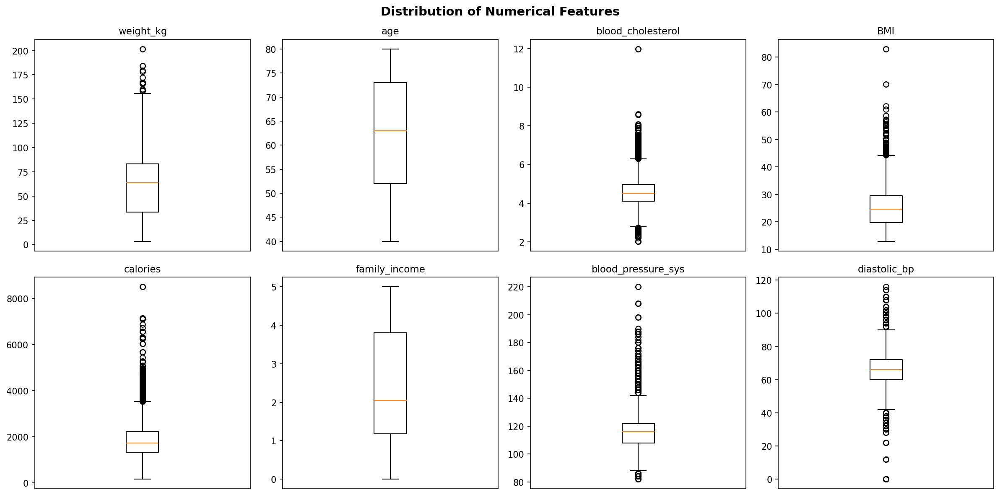
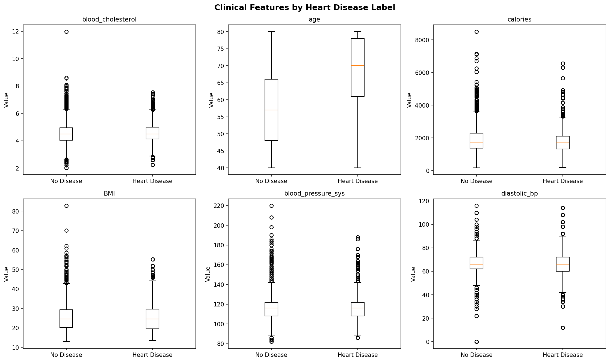
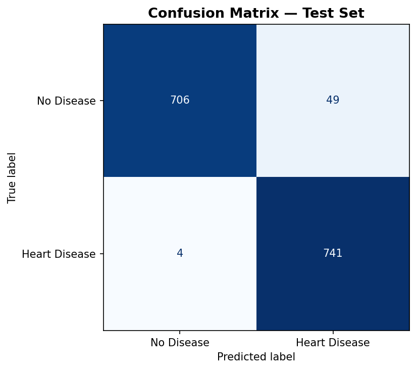
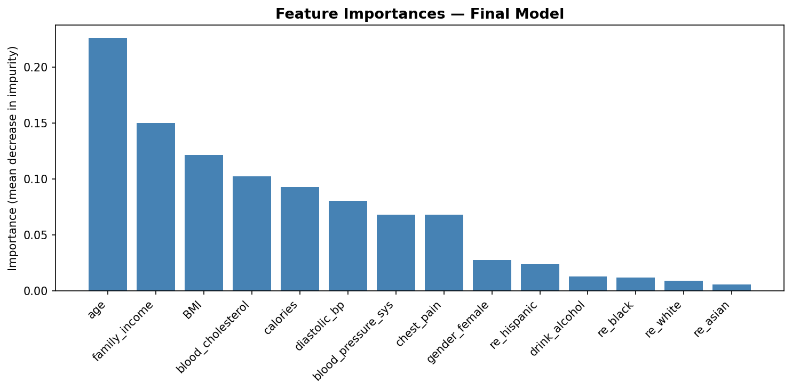

# Heart Disease Risk Prediction Engine

> **96.4% test accuracy** on 8,000 patient records — interpretable Decision Tree pipeline for cardiovascular risk screening.

---

## Overview

A health tech startup needed a machine learning model to assess cardiovascular risk from patient vitals and lifestyle data. The core constraint was **interpretability** — predictions had to be traceable through human-readable decision paths so clinicians could review and validate them.

I built the full end-to-end pipeline: exploratory data analysis, one-hot feature engineering, Decision Tree classification, and hyperparameter tuning via grid search across 180 combinations.

## Results

| Metric | Value |
|---|---|
| Dataset | 8,000 de-identified patient records |
| Features | 14 clinical + lifestyle variables |
| Hyperparameter combinations evaluated | 180 |
| **Test accuracy** | **96.4%** |

## Dataset

NHANES (National Health and Nutrition Examination Survey) cohort data, pre-processed for cardiovascular risk modeling. Features include:

- **Vitals:** age, BMI, blood pressure (systolic + diastolic), blood cholesterol
- **Lifestyle:** calories, alcohol consumption, family income
- **Demographics:** gender, race/ethnicity
- **Clinical history:** chest pain history

Target: binary heart disease label (balanced 50/50 split).

## Pipeline

```
Raw CSV
  └── EDA (box plots, crosstabs, label-stratified distributions)
        └── Feature Engineering (one-hot encoding of categoricals)
              └── Train/Val/Test Split (5000 / 1500 / 1500)
                    └── Grid Search (criterion × max_depth × min_samples_split)
                          └── Final Model Evaluation + Tree Visualization
```

## Key Findings

**Top predictors** (by feature importance):
1. `chest_pain` — strongest single predictor
2. `age`
3. `blood_cholesterol`
4. `blood_pressure_sys`
5. `BMI`

**Optimal hyperparameters:**
- Criterion: `entropy`
- Max depth: `30`
- Min samples split: `4`

## Visualizations

| EDA — Feature Distributions | Features by Label |
|---|---|
|  |  |

| Confusion Matrix | Feature Importance |
|---|---|
|  |  |

## Clinical Cost Analysis

Standard accuracy treats all misclassifications equally — that's insufficient for a clinical screening tool.

| Error | Clinical consequence |
|---|---|
| **False Negative** | Missed disease → patient goes untreated → highest cost |
| **False Positive** | Unnecessary follow-up tests → costly but manageable |

In production, the classification threshold should be tuned to minimize false negatives, accepting a higher false positive rate. The interpretable tree structure allows clinicians to directly inspect which decision paths lead to FN outcomes.

## Stack

`Python` · `pandas` · `scikit-learn` · `NumPy` · `matplotlib` · `graphviz`

## Quickstart

```bash
# 1. Clone and install
git clone https://github.com/Sohaibsajid50/sohaibsajid50-ml.git
cd sohaibsajid50-ml/heart-disease-risk-prediction
pip install -r requirements.txt

# 2. Add your data
# Place NHANES-heart.csv in the project root

# 3. Run the notebook
jupyter notebook heart_disease_risk_prediction.ipynb
```

## Project Structure

```
heart-disease-risk-prediction/
├── heart_disease_risk_prediction.ipynb   # Full analysis pipeline
├── requirements.txt                       # Pinned dependencies
├── images/                               # Output visualizations
│   ├── eda_boxplots.png
│   ├── eda_by_label.png
│   ├── eda_categorical.png
│   ├── confusion_matrix.png
│   └── feature_importance.png
└── README.md
```

---

*Built by [Sohaib Sajid](https://github.com/Sohaibsajid50)*
