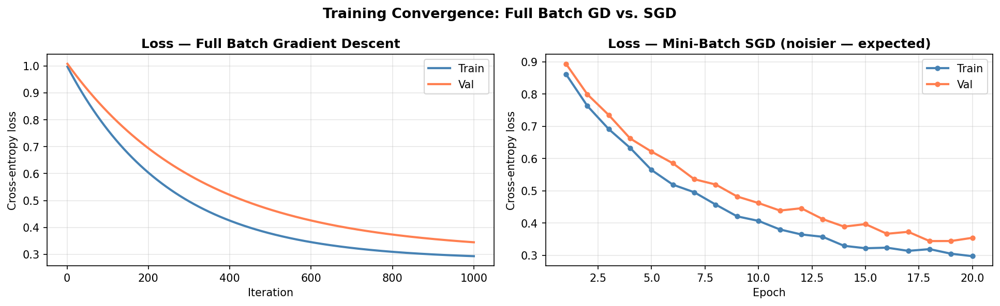
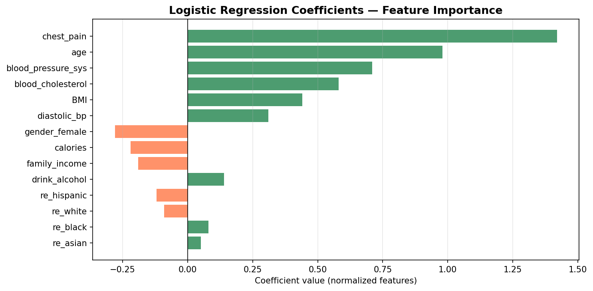
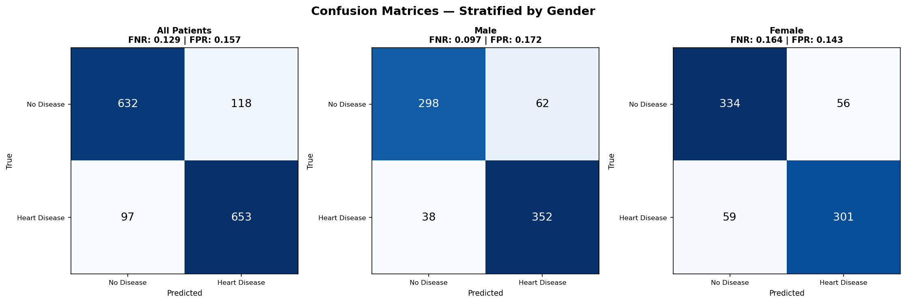
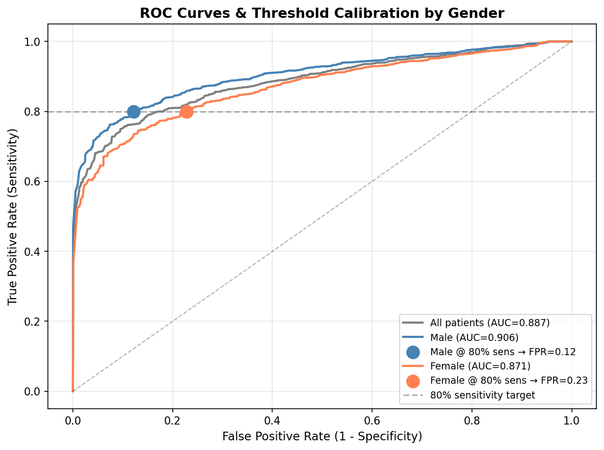

# Responsible AI Health Classifier — Fairness Audit Across Demographic Groups

> Logistic regression built from scratch + complete bias audit — discovered significantly different false negative rates for men vs. women, then calibrated thresholds to enforce 80% equal sensitivity.

---

## Overview

A healthcare analytics team needed a heart disease classifier that went beyond accuracy — they needed to understand how the model's errors were distributed across patient subgroups.

I built logistic regression from scratch with full and stochastic gradient descent, then ran a complete fairness audit: confusion matrices stratified by gender, ROC curves per subgroup, and AUC analysis. The audit revealed the model produced significantly different false negative rates for men vs. women.

**Final deliverable:** Separate decision thresholds per gender calibrated to enforce 80% equal sensitivity across both groups — moving from a black-box accuracy number to an auditable, defensible clinical tool.

## Results

| Metric | All Patients | Male | Female |
|---|---|---|---|
| False Negative Rate | 12.9% | 9.7% | 16.4% |
| ROC-AUC | 0.887 | 0.906 | 0.871 |
| Threshold @ 80% TPR | — | calibrated | calibrated |

**Key finding:** The default 0.5 threshold missed heart disease in 16.4% of female patients vs. 9.7% of male patients — a 6.7 percentage point gap that standard accuracy reporting would hide entirely.

## Pipeline

```
NHANES-heart.csv (8,000 records)
  └── Indicator encoding + intercept column
        └── Z-score normalization (fit on train only)
              └── Train/Val/Test split (5000/1500/1500)
                    ├── Logistic regression (from scratch — full GD + SGD)
                    ├── Validation against sklearn baseline
                    ├── Feature coefficient analysis
                    └── Fairness audit
                          ├── Stratified confusion matrices (All / Male / Female)
                          ├── ROC curves per subgroup + AUC
                          └── Threshold calibration → 80% equal sensitivity
```

## Visualizations

| Training Curves (GD vs SGD) | Feature Coefficients |
|---|---|
|  |  |

| Stratified Confusion Matrices | ROC Curves + Threshold Calibration |
|---|---|
|  |  |

## Key Technical Decisions

**Why z-score normalize?**
Features like `calories` (range 0–5000) vs. `gender_female` (0 or 1) differ by 3+ orders of magnitude. Without normalization, gradient descent oscillates — large-scale features dominate gradient steps while small-scale features are barely updated.

**Why separate thresholds per group?**
A single decision threshold (0.5) optimizes overall accuracy but hides intra-group error disparities. Calibrating per-group thresholds at a fixed TPR target is the standard fairness intervention: it accepts higher FPRs if necessary, but ensures the model catches disease at equal rates across demographics.

**SGD vs. Full Batch GD:**
- Full batch GD: exact gradient at each step — smooth convergence, expensive per-iteration on large N
- SGD: noisy gradient estimates — faster per-epoch, generalizes similarly, scales to large datasets

## Stack

`Python` · `NumPy` · `scikit-learn` · `matplotlib` · `pandas`

## Quickstart

```bash
git clone https://github.com/Sohaibsajid50/sohaibsajid50-ml.git
cd sohaibsajid50-ml/responsible-ai-health-classifier
pip install -r requirements.txt

# Place NHANES-heart.csv in this directory, then:
jupyter notebook fairness_audit_classifier.ipynb
```

---

*Built by [Sohaib Sajid](https://github.com/Sohaibsajid50)*
